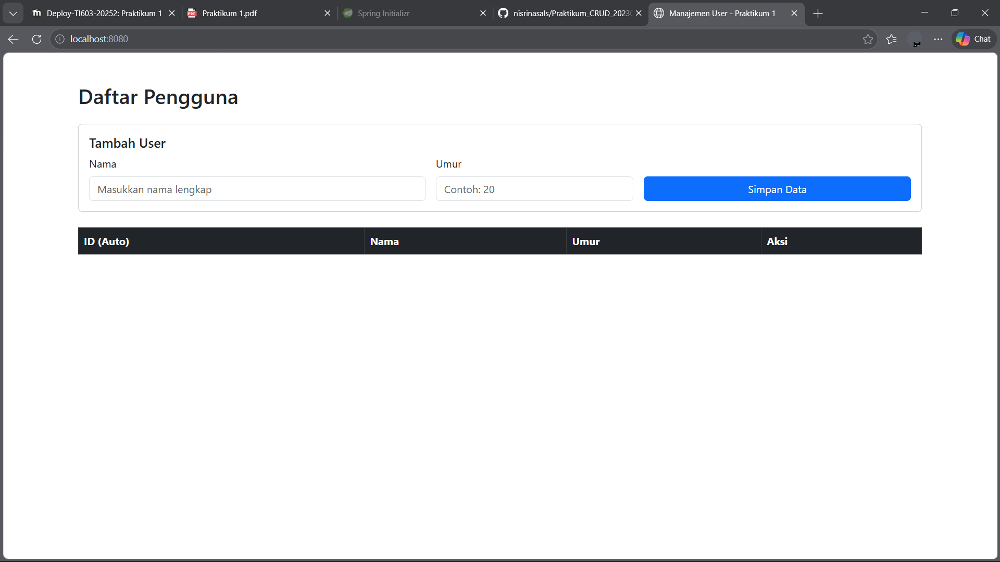
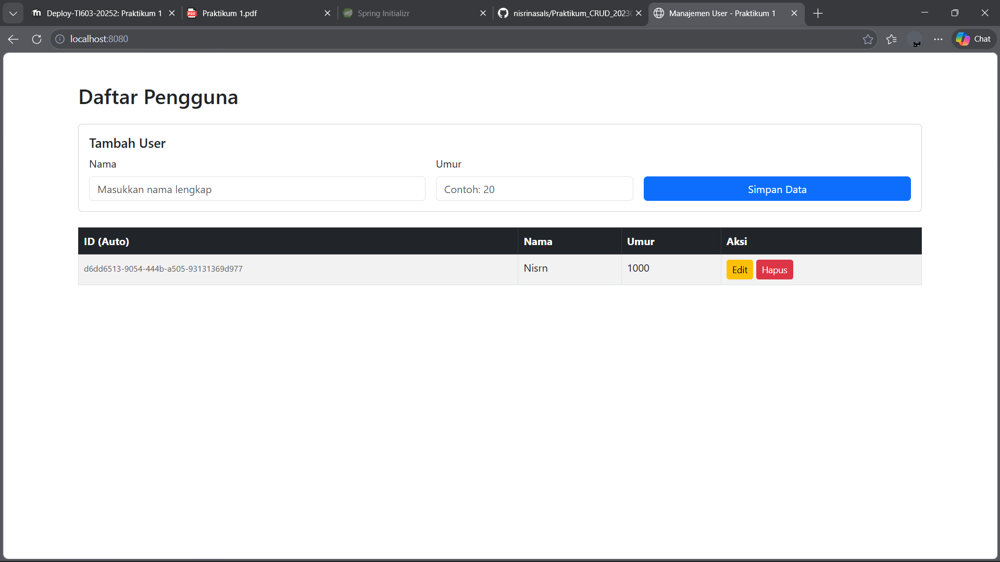
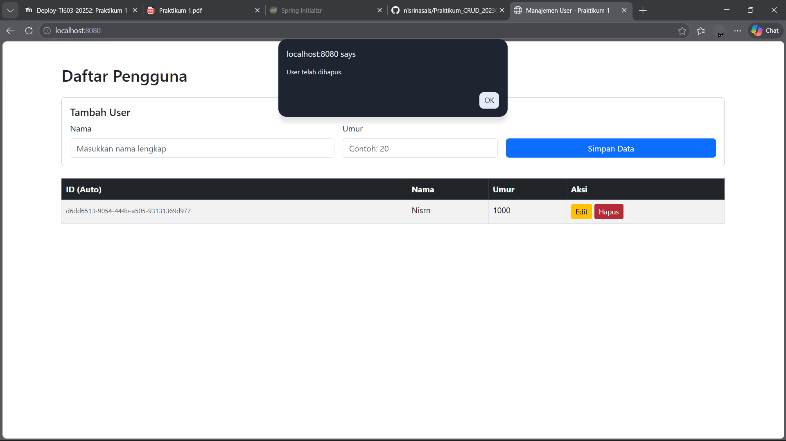

# User API Spesification

## Create User 
Endpoint : POST /api/users

Request Body :

```json
{
  "nama" : "nisr",
  "usia" : 21
}
```


Response Body (success) :

```json
{
  "data": {
    "id": "97a0b858-4a51-4fb4-b189-e03c9a0cfaa4",
    "name": "nisr",
    "usia": 21
  }
}
```


Response Body (failed) :

```json
{
  "error": "User not found"
}
```

## Delete User
Endpoint : DELETE /api/users/id

```json
{
  "message": "User deleted successfully"
}
```

Response Body (failed) :
```json
{
  "error": "User not found"
}
```


## Screenshoot

kondisi kosong


add data


update user


delete user
